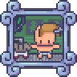

	

<h3 align="center">Character generator importer tool</h3>

  

   speed up the process of creating animations from the character generator 2.0
	 
	·
	<a href="https://github.com/indie-pipeline/character-generator-importer-tool/issues/new?assignees=ninetailsrabbit&labels=%F0%9F%90%9B+bug&projects=&template=bug_report.md&title=">Report Bug</a>
	·
	<a href="https://github.com/indie-pipeline/character-generator-importer-tool/issues/new?assignees=ninetailsrabbit&labels=%E2%AD%90+feature&projects=&template=feature_request.md&title=">Request Features</a>
  

 
 

- [📦 Installation](#-installation)

# 📦 Installation

1. [Download Latest Release](https://github.com/indie-pipeline/character-generator-importer-tool/releases/latest)
2. Unpack the `addons/indiepipeline.character-generator-importer-tool` folder into your `/addons` folder within the Godot project
3. Enable this addon within the Godot settings: `Project > Project Settings > Plugins`

To better understand what branch to choose from for which Godot version, please refer to this table:
|Godot Version|Character generator importer tool Branch|Character generator importer toolVersion|
|---|---|--|
||`main`|`1.x`|
